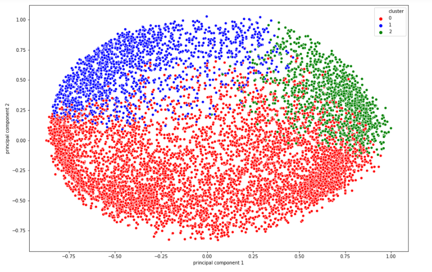
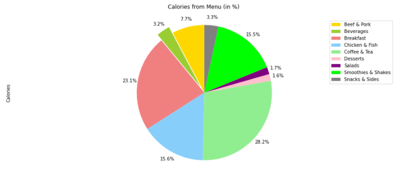
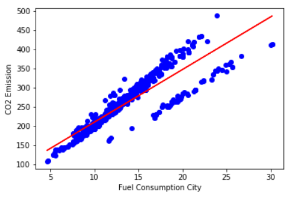

# Feni Rahmi Portfolio
My data science portfolio 

# [Project 1 : Credit Card Customer Segmentation](https://github.com/FeniRahmi/CC_segmentation/blob/main/C2G6%20CC%20(3%20clusters)%20updated.ipynb)
* Created a model that estimate credit card customer segmentation to help the company to define marketing strategy.
* The sample Dataset summarizes the usage behavior of about 9000 active credit card holders during the last 6 months.
* The file is at a customer level with 18 behavioral variables.
* Using K-Means algorithm with the K value determined by silhouette score.
* Using PCA for dimension reduction and better visualization.

# [Project 2 : Titanic Survival Passenger using Random Forest Algorithm](https://github.com/FeniRahmi/Titanic/blob/main/Titanic%20Survival%20Passenger%20using%20Random%20Forest%20Algorithm.ipynb)
* For this example project I predicted the survival status (0 = No, 1 = Yes) from the Titanic passenger.
* Using Random Forest classifier.
* Creating new feature (feature engineering).
* The submission score in kaggle is 0.76, which not bad for the first attempt.

# [Project 3 : Exploratory Data Analysis : Nutrition Fact for McDonald's Menu](https://github.com/FeniRahmi/McDonald_EDA/blob/main/McDonald%20EDA.ipynb)
I have explored the McDonald's dataset to find the answers for the following questions:
* How many calories does the average McDonald's value meal contain?
* How much do beverages, like soda or coffee, contribute to the overall caloric intake?
* Does ordered grilled chicken instead of crispy increase a sandwich's nutritional value?
* What about ordering egg whites instead of whole eggs?

# [Project 4 : Estimation of CO2 Emission using Simple Regression](https://github.com/FeniRahmi/Regression/blob/main/co2%20estimation%20(regression).ipynb)
* This project give a model to predict CO2 emission from car using simple regression algorithm.
* There is one feature which I used in the modeling.
* I have selected the feature using .corr method and manual plotting (features vs target).

# [Project 5 : Payment Matching](https://github.com/FeniRahmi/payment_matching/blob/main/Payment%20matching.ipynb)
At Shopee, the buyer who chooses to place an order using bank transfer is supposed to make the transfer within 2 days after he/she places the order. After that, Shopee will receive a bank statement from the bank and Shopee needs to compare and match the bank statement with the checkout information in order to confirm that this particular order has been paid. Two criteria need to be met in order to match a bank statement with a checkout : amount match and name match. A proper match occurs when both the amount and the name matches on both bank statement and checkout list. Based on the two criteria, I have matched the bank statement IDs to the checkout IDs.

# [Project 6 : People Analytics : Is the employee has best performance or not?](https://github.com/FeniRahmi/People-Analytics/blob/main/People%20Analytics.ipynb)
Using the existing data to predict wether an employee will be classified as best performance or not.
* Machine learning allows HR department to make decision to predict employee performance in the next 1 year using historical KPI (Key Performance Indicator) data owned by the company.
* We used logistic regression, KNN, random forest and gradient boosting to find the best classification model.
* We used AUC (Area Under ROC Curve) as evaluation metric.

# [Project 7 : Market Basket](https://github.com/FeniRahmi/market-basket/blob/main/Market%20Basket.ipynb)
At Shopee, sellers list thousands of products for sale on their platform. A better understanding of users' tastes and preferences for products can help Shopee design better promotions and recommendations for the users. To do that, we conduct market basket analysis which allows us to identify the relationship between different combinations of products that users buy.

# [Project 8 : Nobel Prize Winners](https://github.com/FeniRahmi/nobel-prize-winner/blob/main/NobelPrize.ipynb)
* This project provided by Rasmus Bååth is a Senior Data Scientist at King. Previously, he was an instructor and Curriculum Lead for Projects at DataCamp.
* The Nobel Prize is perhaps the world's most well known scientific award. Every year it is given to scientists and scholars in chemistry, literature, physics, medicine, economics, and peace. Between 1901 and 2016, the Nobel Prizes and the Prize in Economic Sciences were awarded 579 times to 911 people and organizations.
* In this project, I used EDA to answer several questions.

