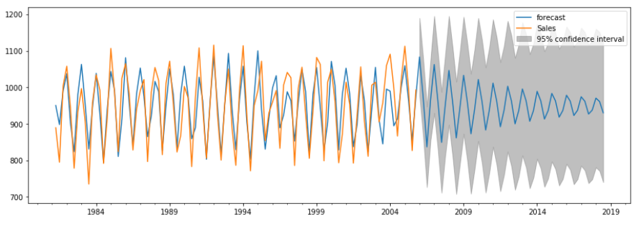

# Feni Rahmi Portfolio
Here are portfolio projects I have worked on before :  

# [Project 1 : Credit Card Customer Segmentation](https://github.com/FeniRahmi/CC_segmentation/blob/main/C2G6%20CC%20(3%20clusters)%20updated.ipynb)
* Created a model that estimate credit card customer segmentation to help the company to define marketing strategy.
* The sample Dataset summarizes the usage behavior of about 9000 active credit card holders during the last 6 months.
* The file is at a customer level with 18 behavioral variables.
* Using K-Means algorithm with the K value determined by silhouette score.
* Using PCA for dimension reduction and better visualization.

# [Project 2 : Titanic Survival Passenger using Random Forest Algorithm](https://github.com/FeniRahmi/Titanic/blob/main/Titanic%20Survival%20Passenger%20using%20Random%20Forest%20Algorithm.ipynb)
* For this example project I predicted the survival status (0 = No, 1 = Yes) from the Titanic passenger.
* Using Random Forest classifier.
* Creating new feature (feature engineering).
* The submission score in kaggle is 0.76, which not bad for the first attempt.

# [Project 3 : Exploratory Data Analysis : Nutrition Fact for McDonald's Menu](https://github.com/FeniRahmi/McDonald_EDA/blob/main/McDonald%20EDA.ipynb)
I have explored the McDonald's dataset to find the answers for the following questions:
* How many calories does the average McDonald's value meal contain?
* How much do beverages, like soda or coffee, contribute to the overall caloric intake?
* Does ordered grilled chicken instead of crispy increase a sandwich's nutritional value?
* What about ordering egg whites instead of whole eggs?

# [Project 4 : Exploratory Data of K-pop Idols](https://github.com/FeniRahmi/EDA-Kpop-idols/blob/main/EDA%20Kpop%20idols.ipynb)
K-pop idols have data! And it will be interesting if we explore this to answer several general questions. I created some features based on the existing features. I used jupyter notebook for this project. The dataset is about K-pop idols profile from 1992 to 2020. I also publish the article about this project in medium : [Feni Rahmi](https://fenirahmi-fr.medium.com/exploratory-data-of-k-pop-idols-8693b44ac312).

# [Project 5 : ... ]()
...

# [Project 6 : Estimation of CO2 Emission using Simple Regression](https://github.com/FeniRahmi/Regression/blob/main/co2%20estimation%20(regression).ipynb)
* This project give a model to predict CO2 emission from car using simple regression algorithm.
* There is one feature which I used in the modeling.
* I have selected the feature using .corr method and manual plotting (features vs target).

# [Project 7 : Movie Recommendation (Content-Based Filtering)](https://github.com/FeniRahmi/Movie-Recommendation/blob/main/Movie%20Reccomendation%20(Content-Based%20Filtering).ipynb)
Recommendation systems are a collection of algorithms used to recommend items to users based on information taken from users. In this notebook, I made movie recommendation system used content-based and implement a simplified version of the system using the Python and Pandas library.

# [Project 8 : People Analytics : Is the employee has best performance or not?](https://github.com/FeniRahmi/People-Analytics/blob/main/People%20Analytics.ipynb)
Using the existing data to predict wether an employee will be classified as best performance or not.
* Machine learning allows HR department to make decision to predict employee performance in the next 1 year using historical KPI (Key Performance Indicator) data owned by the company.
* We used logistic regression, KNN, random forest and gradient boosting to find the best classification model.
* We used AUC (Area Under ROC Curve) as evaluation metric.

# [Project 9 : Payment Matching](https://github.com/FeniRahmi/payment_matching/blob/main/Payment%20matching.ipynb)
At Shopee, the buyer who chooses to place an order using bank transfer is supposed to make the transfer within 2 days after he/she places the order. After that, Shopee will receive a bank statement from the bank and Shopee needs to compare and match the bank statement with the checkout information in order to confirm that this particular order has been paid. Two criteria need to be met in order to match a bank statement with a checkout : amount match and name match. A proper match occurs when both the amount and the name matches on both bank statement and checkout list. Based on the two criteria, I have matched the bank statement IDs to the checkout IDs.

# [Project 10 : Market Basket](https://github.com/FeniRahmi/market-basket/blob/main/Market%20Basket.ipynb)
At Shopee, sellers list thousands of products for sale on their platform. A better understanding of users' tastes and preferences for products can help Shopee design better promotions and recommendations for the users. To do that, we conduct market basket analysis which allows us to identify the relationship between different combinations of products that users buy.

# [Project 11 : A/B Testing for Payment Method](https://github.com/FeniRahmi/AB_testing/blob/main/AB%20testing%20payment%20method.ipynb)
* In this project, a retail company has an idea to use e-payment in the payment system at the cashier. However, other employees thought that using cash was already effective. Therefore, I want to test the use of e-payment at one of the company branches by means of A/B testing. I will test 2 branches: branch A and branch B. Branch A will use cash for the payment, while for Branch B will use e-payment.
* I used T-test and build hypothesis to the parameters : average payment time, convertion rate (proportion of customers who make transactions).

# [Project 12 : Sentiment Analysis about Airlines on Twitter](https://github.com/FeniRahmi/Sentiment-Analysis/blob/main/Sentiment%20Analysis%20about%20Airlines%20on%20Twitter.ipynb)
In this notebook, we want to know the analytical sentiment of Twitter users regarding airlines. Later this sentiment analysis will be useful for a company to be able to find out the shortcomings of their services and improve the quality of their work.

# [Project 13 : Sales Forecasting Using ARIMA](https://github.com/FeniRahmi/Sales-forecasting/blob/main/Sales%20Forecasting%20using%20ARIMA.ipynb)
ARIMA (Auto Regressive Integrated Moving Average) is a simple stochastic time series model that we can use to train and then forecast future time points. ARIMA can capture complex relationships as it takes error terms and observations of lagged terms. These models rely on regressing a variable on past values. In this notebook, I have predicted the sales of a company for the next period.

