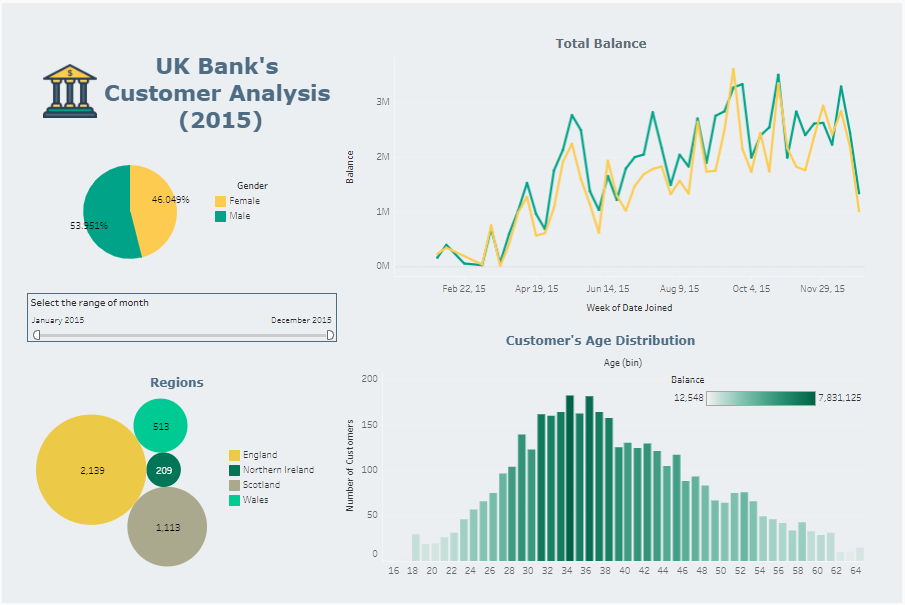
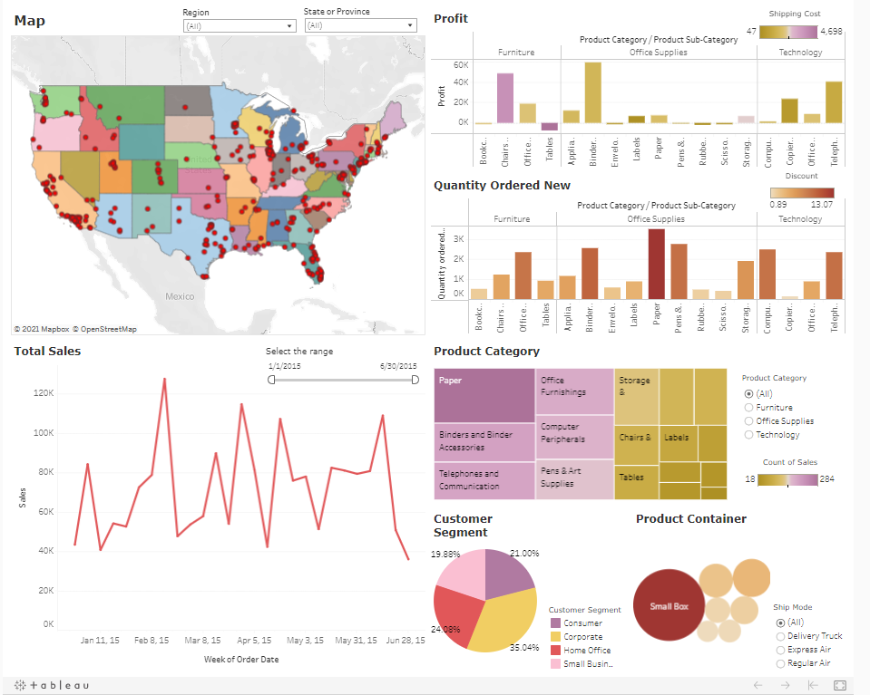
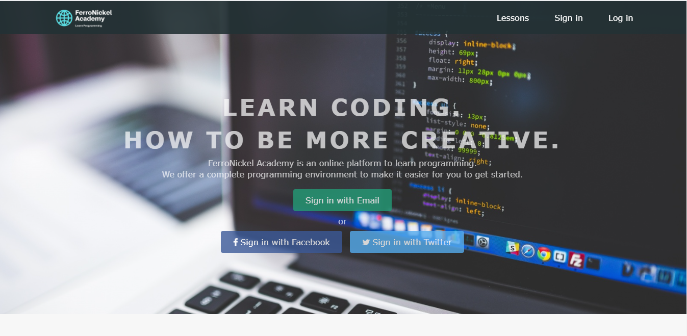

# Feni Rahmi Portfolio

Here are portfolio projects I have worked on before :  

<h2 style="text-align: center;">Exploratory Data Analysis using Python</h2>

# [Project 1 : Exploratory Data of K-pop Idols](https://github.com/FeniRahmi/EDA-Kpop-idols/blob/main/EDA%20Kpop%20idols.ipynb)
K-pop idols have data! And it will be interesting if we explore this to answer several general questions. I created some features based on the existing features. I used jupyter notebook for this project. The dataset is about K-pop idols profile from 1992 to 2020. I have published the article about this project in medium : [Feni Rahmi](https://fenirahmi-fr.medium.com/exploratory-data-of-k-pop-idols-8693b44ac312).

# [Project 2 : Getting Insights from K-pop Groups' Data (1992-2020)](https://github.com/FeniRahmi/EDA-Kpop-2/blob/main/EDA%20KPOP%202.ipynb)
I have analyzed each feature of the K-pop groups data to make the data exploration easier. I used two datasets : K-pop boy group and K-pop girl group profiles from 1992 to 2020. I used pie charts to visualize the data because I want to see the percentage of the totals data. I have published the article about this project in medium : [Feni Rahmi](https://fenirahmi-fr.medium.com/k-pop-groups-data-exploration-5630668ccb89)

# [Project 3 : Exploratory Data Analysis : Nutrition Fact for McDonald's Menu](https://github.com/FeniRahmi/McDonald_EDA/blob/main/McDonald%20EDA.ipynb)
I have explored the McDonald's dataset to find the answers for the following questions:
* How many calories does the average McDonald's value meal contain?
* How much do beverages, like soda or coffee, contribute to the overall caloric intake?
* Does ordered grilled chicken instead of crispy increase a sandwich's nutritional value?
* What about ordering egg whites instead of whole eggs?

<h2 style="text-align: center;">Advanced Excel</h2>

# [Project 4 : Advanced Excel Project Compilations](https://docs.google.com/spreadsheets/d/1hzv58bdAo_fvCofOX7tM7pLGKxiPd8faXj-IkwioewY/edit?usp=sharing)
This is a compilation sheets of different case studies using advanced Excel formula: HLOOKUP, VLOOKUP, ADD-IN SOLVER, PIVOT TABLE, IF conditional, COUNTIF, data validation and drop-down. 

<h2 style="text-align: center;">Tableau Interactive Dashboard</h2>

# [Project 5 : UK Bank Customer Analysis (2015)](https://public.tableau.com/profile/feni.rahmi#!/vizhome/UKBankCustomerAnalysis2015_16180428714670/Dashboard2)
UK Bank balance and customer analysis for 2015. It was weekly, and you can choose the range of the time, from January 2015 to December 2015. I have visualized weekly balance (with gender comparison), gender percentage, job classification, age distribution and region of the UK Bank's customers.

# [Project 6 : Superstore 2015 Interactive Dashboard](https://public.tableau.com/profile/feni.rahmi#!/vizhome/Superstore2015_16174596442950/Dashboard1)
This is an interactive dashboard about product solds at superstore in 2015.

<h2 style="text-align: center;">Machine Learning using Python</h2>

# [Project 7 : Credit Card Customer Segmentation](https://github.com/FeniRahmi/CC_segmentation/blob/main/C2G6%20CC%20(3%20clusters)%20updated.ipynb)
* Created a model that estimate credit card customer segmentation to help the company to define marketing strategy.
* The sample Dataset summarizes the usage behavior of about 9000 active credit card holders during the last 6 months.
* The file is at a customer level with 18 behavioral variables.
* Using K-Means algorithm with the K value determined by silhouette score.
* Using PCA for dimension reduction and better visualization.
* I published the article in medium : [Feni Rahmi](https://fenirahmi-fr.medium.com/credit-card-customers-segmentation-bc3c5c87ddc)

# [Project 8 : Titanic Survival Passenger using Random Forest Algorithm](https://github.com/FeniRahmi/Titanic/blob/main/Titanic%20Survival%20Passenger%20using%20Random%20Forest%20Algorithm.ipynb)
* For this example project I predicted the survival status (0 = No, 1 = Yes) from the Titanic passenger.
* Using Random Forest classifier.
* Creating new feature (feature engineering).
* The submission score in kaggle is 0.76, which not bad for the first attempt.

# [Project 9 : Movie Recommendation (Content-Based Filtering)](https://github.com/FeniRahmi/Movie-Recommendation/blob/main/Movie%20Reccomendation%20(Content-Based%20Filtering).ipynb)
Recommendation systems are a collection of algorithms used to recommend items to users based on information taken from users. In this notebook, I made movie recommendation system used content-based and implement a simplified version of the system using the Python and Pandas library.

# [Project 10 : A/B Testing for Payment Method](https://github.com/FeniRahmi/AB_testing/blob/main/AB%20testing%20payment%20method.ipynb)
* In this project, a retail company has an idea to use e-payment in the payment system at the cashier. However, other employees thought that using cash was already effective. Therefore, I want to test the use of e-payment at one of the company branches by means of A/B testing. I will test 2 branches: branch A and branch B. Branch A will use cash for the payment, while for Branch B will use e-payment.
* I used T-test and build hypothesis to the parameters : average payment time, convertion rate (proportion of customers who make transactions).

<h2 style="text-align: center;">HTML&CSS</h2>

# [Project 11 : Website's Homepage](https://u54lfclrug6m7qb7pszmbw-on.drv.tw/HTML&CSS/)
This is a prototype of an online learning website's homepage builded by HTML and CSS. This website is responsive, you can open it on PC, tablet and smartphone without appearance changing. Also a lesson [page](https://u54lfclrug6m7qb7pszmbw-on.drv.tw/HTML%26CSS/index2.html). Reference : Progate. You can see the full script [here](https://github.com/FeniRahmi/Homepage-html-css).

